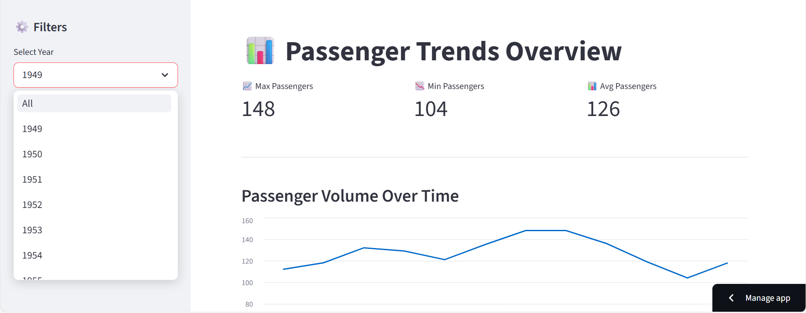

# ✈️ Flight Passenger Dashboard

An interactive web dashboard built with **Streamlit** and **Python** to explore monthly airline passenger numbers from **1949 to 1960**.

The application demonstrates a clean end‑to‑end workflow:
**data loading → transformation → visualization → cloud deployment** using GitHub integration.

---

## 🔗 Live Application

👉 **View the live dashboard:**  
https://flight-data-dashboard-gim9tbgyw3kavjph4soaus.streamlit.app/

---

## 📊 Dashboard Preview

> The dashboard allows users to explore historical airline passenger trends with interactive filtering by year.

---

## 🚀 Features

- ✅ Interactive **year selector dropdown**
- ✅ Automatic recalculation of statistics
- ✅ Responsive data table
- ✅ Time‑series line chart visualization
- ✅ Cached data loading for performance
- ✅ Fully deployed on **Streamlit Cloud**

---

## 🧠 Dataset

- **Source:** International airline passengers dataset  
- **Time span:** 1949 – 1960  
- **Frequency:** Monthly passenger totals

---

## 🛠️ Tech Stack

- **Python**
- **Pandas** – data manipulation
- **Streamlit** – UI & dashboard framework
- **GitHub** – version control
- **Streamlit Cloud** – deployment & hosting

---

## 📂 Project Structure

Marcelo Frazzato
Senior Product Engineer
